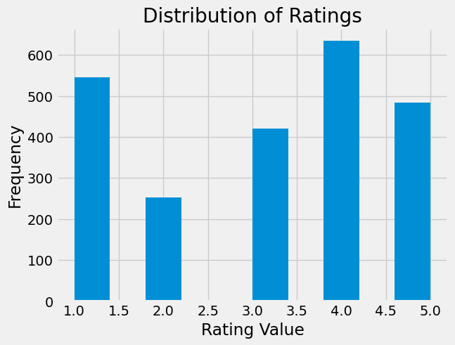
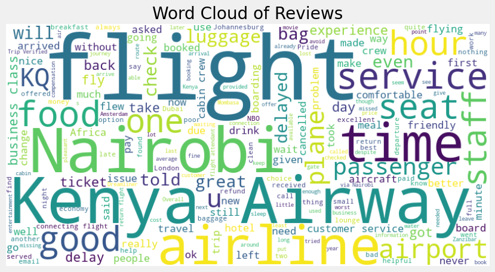

# AIRLINE-SENTIMENT-ANALYSIS

# Authors
* Jeremy Waiguru
* Paul Ngatia
* Winfred Bundi
* Mercy Kiragu

# TABLE OF CONTENTS
1. [BUSINESS UNDERSTANDING](#BUSINESS-UNDERSTANDING)
2. [PROBLEM STATEMENT](#PROBLEM-STATEMENT)
3. [DATA UNDERSTANDING](#DATA-UNDERSTANDING)
4. [VISUALIZATIONS](#VISUALIZATIONS)
5. [MODELLING PROCESS,(DEPLOYMENT)](#MODELLING-AND-DEPLOYMENT)
6. [EVALUATION](#EVALUATION)
7. [CONCLUSIONS](#CONCLUSIONS)
8. [RECOMMENDATIONS](#RECOMMENDATIONS)

# BUSINESS UNDERSTANDING.

In the competitive aviation industry, customer satisfaction plays a vital role in shaping the reputation and success of an airline. Kenya Airways, like many airlines, receives numerous reviews from passengers, which contain valuable feedback about their experiences. Understanding the sentiments behind these reviews is essential for identifying strengths and weaknesses in service delivery. This project will leverage sentiment analysis to process and analyze customer feedback, enabling Kenya Airways to make informed decisions that enhance passenger satisfaction and loyalty.

# PROBLEM STATEMENT.

Kenya Airways is challenged by the vast amount of unstructured customer feedback available through online reviews. Without an efficient method to analyze this feedback, the airline may overlook critical insights that could lead to service improvements. This project aims to address this challenge by systematically analyzing the sentiment of customer reviews, providing Kenya Airways with a clear understanding of customer perceptions and identifying key areas that require attention.

# DATA UNDESRTANDING

We did Web Scraping from the 3 websites below and merged our datasets

1. <https://uk.trustpilot.com/review/www.kenya-airways.com> 

2. <https://www.airlinequality.com/airline-reviews/kenya-airways/>

3. <https://www.airlineratings.com/airlines/kenya-airways>

# VISUALIZATIONS 

A majority of ratings cluster around the higher end of the scale, with 4.0 and 5.0 being the most frequent. This indicated a positive bias in the dataset, as lower ratings are significantly less common. Such a distribution might suggest high overall customer satisfaction or potential rating inflation. 

Word cloud to visually represent the most common words found in both positive and negative reviews, providing insights into key themes and sentiments expressed by users. 

# MODELLING AND DEPLOYMENT

In the context of engagement prediction, the approach involves several key steps: data splitting for training, testing, followed by the training and evaluation of various models.

To build our Classifier and predictive system we explored the various models listed below;

 1. Logistic Regression with TF-IDF
 2. Naive Bayes
 3. SVM
 4. Random Forest
 5. XG-Boost

 These models are assessed using metrics like Accuracy, RMSE, and ROC Curve with an emphasis on achieving high accuracy in sentiment analysis. Hyperparameter tuning and ensemble modeling are used to enhance model performance, and the best-performing models are selected.

 Additionally, natural language understanding (NLU) was implemented to extract context from user reviews for personalized responses. Testing and training ensure appropriate responses to various sentiments, and best model is integrated with the user interface and deployed at scale, using Streamlit and Pickle for model deployment. The project's scalability allows Kenya Airways to customize sentiment analysis and engagement prediction for their specific needs, fostering industry-wide improvements in customer engagement and satisfaction. 

 # EVALUATION

